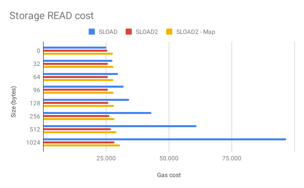
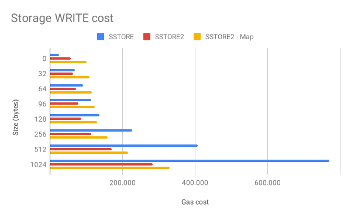

# SLOAD2 & SLOAD2-Map


[](https://github.com/0xsequence/sstore2/actions/workflows/tests.yml)

SLOAD2 is a set of Solidity libraries for writing and reading contract storage paying a fraction of the cost, it uses contract code as storage, writing data takes the form of contract creations and reading data uses `EXTCODECOPY`.

> **The library is not audited, it's recommended to perform a full audit of SSTORE2 and CREATE3 before using this code on a production envirovment.**

## Features

- All SLOAD2 storages are write-once only
- Key Value storage (custom key and auto-gen key)
- Cheaper storage reads (vs SLOAD) after 32 bytes
- Cheaper storage writes (vs SSTORE) after 32 bytes (auto-gen key)
- Cheaper storage writes (vs SSTORE) after 96 bytes (custom key)
- Use strings as keys
- Use bytes32 as keys
- Use address as keys (auto-gen)

## Gas savings

Gas costs are overall lower compared with traditional SSTORED and SLOAD operations, SLOAD2 (auto-generated key) and SLOAD2-Map (custom key) have different costs associated with using them.

The root cause is that custom-key SLOAD2 needs to use CREATE3 to deploy the data contract, and CREATE3 needs to deploy an aditional proxy contract for each deployed contract.

### SLOAD Cost (data read)

Reading data is a lot cheaper compared to native SLOAD operations (native solidity storage).

After reading 32 bytes `SSTORE2.read` becomes the cheaper option, and `SSTORE2Map.read` becomes cheaper when reading 33 bytes or more.

| Size (bytes) | SLOAD     | SLOAD2 | SLOAD2 - Map | Savings | Savings (map) |
|--------------|-----------|--------|--------------|---------|---------------|
|            0 |     2.679 |  3.102 |        5.258 |   0,86x |         0,51x |
|            2 |     2.852 |  3.108 |        5.261 |   0,92x |         0,54x |
|           32 |     4.914 |  3.108 |        5.264 |   1,58x |         0,93x |
|           33 |     7.067 |  3.114 |        5.267 |   2,27x |         1,34x |
|           64 |     7.067 |  3.114 |        5.270 |   2,27x |         1,34x |
|           96 |     9.220 |  3.120 |        5.276 |   2,96x |         1,75x |
|          128 |    11.373 |  3.126 |        5.282 |   3,64x |         2,15x |
|          256 |    19.985 |  3.150 |        5.306 |   6,34x |         3,77x |
|          512 |    37.209 |  3.198 |        5.355 |  11,64x |         6,95x |
|         1024 |    71.659 |  3.296 |        5.454 |  21,74x |        13,14x |
|        24576 | 1.349.161 |  7.627 |        9.805 | 176,89x |       137,60x |



### SSTORE Cost (data writes)

Writing data is also cheaper than native SSTORE operations (native solidity storage), but gains become apparent after higher data sizes.

After writing 32 bytes `SSTORE2.write` becomes the cheaper option, and `SSTORE2Map.write` becomes cheaper only when writing 128 bytes or more.

| Size (bytes) | SSTORE     | SSTORE2   | SSTORE2 - Map | Savings | Savings (map) |
|--------------|------------|-----------|---------------|---------|---------------|
|            0 |      2.660 |    35.323 |        73.565 |   0,08x |         0,04x |
|            2 |     22.607 |    35.819 |        74.061 |   0,63x |         0,31x |
|           32 |     44.810 |    41.891 |        80.218 |   1,07x |         0,56x |
|           33 |     66.980 |    42.187 |        80.514 |   1,59x |         0,83x |
|           64 |     66.980 |    48.459 |        86.870 |   1,38x |         0,77x |
|           96 |     89.150 |    55.027 |        93.523 |   1,62x |         0,95x |
|          128 |    111.320 |    61.595 |       100.175 |   1,81x |         1,11x |
|          256 |    200.000 |    87.869 |       126.786 |   2,28x |         1,58x |
|          512 |    377.360 |   140.417 |       180.010 |   2,69x |         2,10x |
|         1024 |    732.080 |   245.522 |       286.475 |   2,98x |         2,56x |
|        24576 | 13.878.890 | 4.148.020 |     4.244.998 |   3,35x |         3,27x |



> **Notice:** gas savings may change in future Ethereum hard-forks.

> **Notice x2:** due to contract code limits 24576 bytes is the maximum amount of data that can be written in a single pointer / key. Attempting to write more will result in failure.

## Installation

`yarn add https://github.com/0xsequence/sstore2`

or

`npm install --save https://github.com/0xsequence/sstore2`

## Usage

SSTORE2 comes in two flavors, `SSTORE2` and `SSTORE2Map`. The main difference is that `SSTORE2` auto-generates a key or "pointer" for later data reads, and `SSTORE2Map` let's you use a custom pointer in the form of a `bytes32` key.

`SSTORE2` is cheaper because it only needs to use `CREATE`. `SSTORE2Map` is a little more expensive (~ +50k gas) because it makes use of [CREATE3](https://github.com/0xsequence/create3), which requires using both CREATE2 + CREATE at the same time.


## SSTORE2

Calling `SSTORE2.write` with some `data` returns an `address` pointer; this pointer address can later be feed into `SSTORE2.read` to retrieve the same `data`. Every time `write` is called it generates a new pointer, pointers can't be deleted.

> Notice: reading a never an invalid pointer may return an empty bytes array **or** contract bytecode.

```solidity
pragma solidity ^0.8.0;

import "@0xsequence/sstore2/contracts/SSTORE2.sol";


contract Demo {
  address private pointer;

  function setText(string calldata _text) external {
    pointer = SSTORE2.write(bytes(_text));
  }

  function getText() external view returns (string memory) {
    return string(SSTORE2.read(pointer));
  }
}
```

### Arbitrary size immutables

Solidity 0.8.9 doesn't support variable size immutable variables; these can be emulated using SSTORE2 and immutable pointers.

```solidity
pragma solidity ^0.8.0;

import "@0xsequence/sstore2/contracts/SSTORE2.sol";


contract Demo {
  address private immutable dataPointer;

  constructor(bytes memory _data) {
    dataPointer = SSTORE2.write(_data);
  }

  function getData() external view returns (bytes memory) {
    return SSTORE2.read(dataPointer);
  }
}

contract Broken {
  // Fails to build, non-primite types
  // can't be used as immutable variables

  bytes private immutable data;

  constructor(bytes memory _data) {
    data = _data;
  }
}

```

## SSTORE2Map

SSTORE2Map behaves similarly to SSTORE2, but instead of auto-generating a pointer on each `SSTORE2Map.write` call it takes an arbitrary `key` in the form of a `bytes32` variable; this key must later be provided to `SSTORE2Map.read` to retrieve the written value.

The map store is also write-once, meaning that calling `SSTORE2Map.write` TWICE with the same key will fail. There is no mechanism for deleting or removing the value of a given key.

> Notice: reading a never written key will always return an empty array of bytes.

```solidity
pragma solidity ^0.8.0;

import "@0xsequence/sstore2/contracts/SSTORE2Map.sol";


contract Demo {
  bytes32 private constant KEY = 0xd4e56740f876aef8c010b86a40d5f56745a118d0906a34e69aec8c0db1cb8fa3;

  function setHashes(bytes32[] calldata _hashes) external {
    SSTORE2Map.write(KEY, abi.encode(_hashes));
  }

  function getHashes() external view returns (bytes32[] memory) {
    return abi.decode(SSTORE2Map.read(KEY), (bytes32[]));
  }
}

```

### Using multiple keys

SSTORE2Map supports using multiple keys at the same time, but re-using a key will result in failure.

```solidity
pragma solidity ^0.8.0;

import "@0xsequence/sstore2/contracts/SSTORE2Map.sol";


contract Demo {
  // This works
  function good() external {
    SSTORE2Map.write(string("@key-1"), bytes("hola"));
    SSTORE2Map.write(string("@key-2"), bytes("mundo"));
  }

  // This reverts
  function bad() external {
    SSTORE2Map.write(string("@key-3"), bytes("adios"));
    SSTORE2Map.write(string("@key-3"), bytes("mundo"));
  }
}

```

> Notice: `strings` can be used as `SSTORE2Map`; they get internally mapped as `keccak256(bytes(<string>)`.

# Reading slices

Both `SSTORE2` and `SSTORE2Map` support reading data slices; their behaviors mirror javascript's `.slice(start, end)`.

The functionality can be used for future-proofing a contract in the case that code merkelization is ever implemented.

```solidity
pragma solidity ^0.8.0;

import "@0xsequence/sstore2/contracts/SSTORE2.sol";


contract Demo {
  event Sliced(bytes _data);

  function goodSlices() external {
    address pointer = SSTORE2.write(hex"11_22_33_44");

    // 0x223344
    emit Sliced(
      SSTORE2.read(pointer, 1)
    );

    // 0x2233
    emit Sliced(
      SSTORE2.read(pointer, 1, 3)
    );

    // 0x
    emit Sliced(
      SSTORE2.read(pointer, 3, 3)
    );

    // 0x3344
    emit Sliced(
      SSTORE2.read(pointer, 2, 42000)
    );

    // 0x
    emit Sliced(
      SSTORE2.read(pointer, 41000, 42000)
    );
  }

  function badSlies() external {
    address pointer = SSTORE2.write(hex"11_22_33_44");

    // This reverts
    // start must be equal or lower than end
    emit Sliced(
      SSTORE2.read(pointer, 3, 2)
    );
  }
}

```

# License

```
MIT License

Copyright (c) [2018] [Ismael Ramos Silvan]

Permission is hereby granted, free of charge, to any person obtaining a copy
of this software and associated documentation files (the "Software"), to deal
in the Software without restriction, including without limitation the rights
to use, copy, modify, merge, publish, distribute, sublicense, and/or sell
copies of the Software, and to permit persons to whom the Software is
furnished to do so, subject to the following conditions:

The above copyright notice and this permission notice shall be included in all
copies or substantial portions of the Software.

THE SOFTWARE IS PROVIDED "AS IS", WITHOUT WARRANTY OF ANY KIND, EXPRESS OR
IMPLIED, INCLUDING BUT NOT LIMITED TO THE WARRANTIES OF MERCHANTABILITY,
FITNESS FOR A PARTICULAR PURPOSE AND NONINFRINGEMENT. IN NO EVENT SHALL THE
AUTHORS OR COPYRIGHT HOLDERS BE LIABLE FOR ANY CLAIM, DAMAGES OR OTHER
LIABILITY, WHETHER IN AN ACTION OF CONTRACT, TORT OR OTHERWISE, ARISING FROM,
OUT OF OR IN CONNECTION WITH THE SOFTWARE OR THE USE OR OTHER DEALINGS IN THE
SOFTWARE.
```