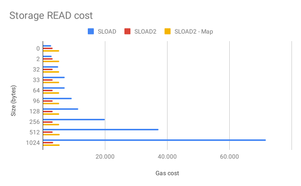
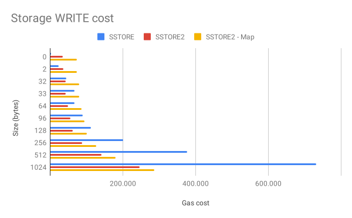

# SLOAD2 & SLOAD2-Map

SLOAD2 is a set of Solidity libraries for writing and reading contract storage paying a fraction of the cost, it uses contract code as storage, writing data takes the form of contract creations and reading data uses `EXTCODECOPY`.

## Features

- All SLOAD2 storages are write-once only
- Key Value storage (custom key and auto-gen key)
- Cheaper storage reads (vs SLOAD) after 32 bytes
- Cheaper storage writes (vs SSTORE) after 32 bytes (auto-gen key)
- Cheaper storage writes (vs SSTORE) after 96 bytes (custom key)
- Use strings as keys
- Use bytes32 as keys
- Use address as keys (auto-gen)

## Gas savings

Gas costs are overall lower compared with traditional SSTORED and SLOAD operations, SLOAD2 (auto-generated key) and SLOAD2-Map (custom key) have different costs associated with using them.

The root cause is that custom-key SLOAD2 needs to use CREATE3 to deploy the data contract, and CREATE3 needs to deploy an aditional proxy contract for each deployed contract.

### SLOAD Cost (data read)

Reading data is a lot cheaper compared to native SLOAD operations (native solidity storage).

After reading 32 bytes `SSTORE2.read` becomes the cheaper option, and `SSTORE2Map.read` becomes cheaper when reading 33 bytes or more.

| SIZE  | SLOAD   | SLOAD2 | SLOAD2 - Map |
|-------|---------|--------|--------------|
|     0 |   25135 |  25534 |        27741 |
|    32 |   27448 |  25618 |        27825 |
|    33 |   29697 |  25717 |        27921 |
|    64 |   29679 |  25702 |        27909 |
|    96 |   31910 |  25774 |        27994 |
|   128 |   34141 |  25870 |        28078 |
|   256 |   43066 |  26207 |        28415 |
|   512 |   60915 |  26881 |        29089 |
|  1024 |   96618 |  28232 |        30441 |
| 24576 | 1422666 |  81124 |        83364 |

### SSTORE Cost (data writes)

Writing data is also a lot cheaper compared to native SSTORE operations (native solidity storage), but gains become aparent after higher data sizes.

After writing 32 bytes `SSTORE2.write` becomes the cheaper option, and `SSTORE2Map.write` becomes cheaper only when writting 96 bytes or more.

| SIZE  | SSTORE   | SSTORE2 | SSTORE2 - Map |
|-------|----------|---------|---------------|
|     0 |    25138 |   57097 |        101312 |
|    32 |    67812 |   64189 |        108489 |
|    64 |    90494 |   71269 |        115653 |
|    96 |   113176 |   78349 |        122818 |
|   128 |   135858 |   85429 |        129982 |
|   256 |   226574 |  113739 |        158629 |
|   512 |   408006 |  170359 |        215925 |
|  1024 |   770870 |  283608 |        330534 |
| 24576 | 14220516 | 4488942 |       4591893 |

## Installation

`yarn add https://github.com/0xsequence/sstore2`

or

`npm install --save https://github.com/0xsequence/sstore2`

## Usage

WIP
